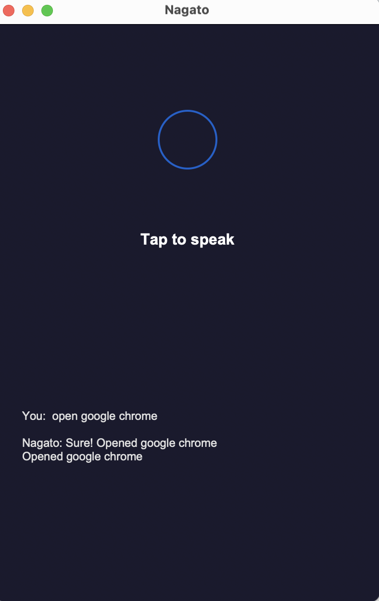
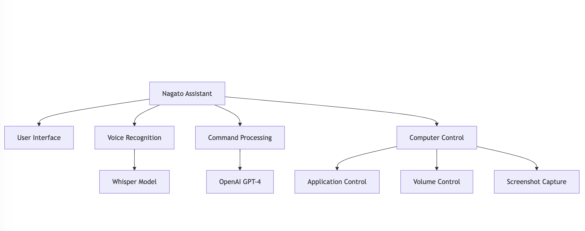

# Voice-Controlled 🎙️

A simple voice-controlled computer assistant that listens to your commands and controls your computer.



## What it does

- **Listen to your voice** - Uses OpenAI Whisper to understand what you say
- **Type commands** - You can also type instead of speaking
- **Control your computer** - Opens apps, changes volume, takes screenshots
- **Smart responses** - Uses GPT-4 to understand natural language
- **Audio feedback** - Talks back to confirm what it's doing

## How to set it up

1. **Download the code:**
```bash
git clone https://github.com/allglenn/voice-controlled-computer-assistant.git
cd voice-controlled-computer-assistant
```

2. **Create a virtual environment:**
```bash
python -m venv assistant-env
source assistant-env/bin/activate  # On Windows: assistant-env\Scripts\activate
```

3. **Install what you need:**
```bash
pip install -r requirements.txt
```

4. **Add your OpenAI API key:**
```bash
cp .env.example .env
# Edit the .env file and add your OpenAI API key
```

## How to use it

1. **Start the assistant:**
```bash
python main.py
```

2. **Give it commands:**
   - Click the circle and speak: "Open Chrome"
   - Or type in the text box: "Turn up volume"

## Example commands

- "Open Chrome browser"
- "Set volume to 50"
- "Take a screenshot" 
- "Type hello world"
- "Open Safari and search for weather"

## Settings

Edit the `.env` file to change:

```
OPENAI_API_KEY=your_key_here
LLM_MODEL=gpt-4
WHISPER_MODEL=base
TTS_VOICE=alloy
TTS_ENABLED=true
```

## What you need

- Python 3.7 or newer
- OpenAI API key
- A microphone
- Windows, Mac, or Linux computer

## File structure

```
assistant/
├── main.py              # Start here
├── nagato_ui.py         # The interface
├── services/
│   ├── vtt.py          # Voice recognition
│   ├── nagato_agent.py # Command processing
│   └── computer_control.py # System controls
└── requirements.txt     # Dependencies
```

## Architecture



## Contributing

Want to help improve this? 

1. Fork the project
2. Make your changes
3. Submit a pull request

## License

MIT License - feel free to use and modify

## Contact

**Mursaleen** - Developer & Tech Enthusiast

- 🌐 [Website](https://mursaleen.example.com/)
- 📧 [mursaleen.dev@gmail.com](mailto:mursaleen.dev@gmail.com)
- 💼 [LinkedIn](https://linkedin.com/in/mursaleen)
- 💻 [GitHub](https://github.com/mursaleen)

Built with ❤️ by Mursaleen
